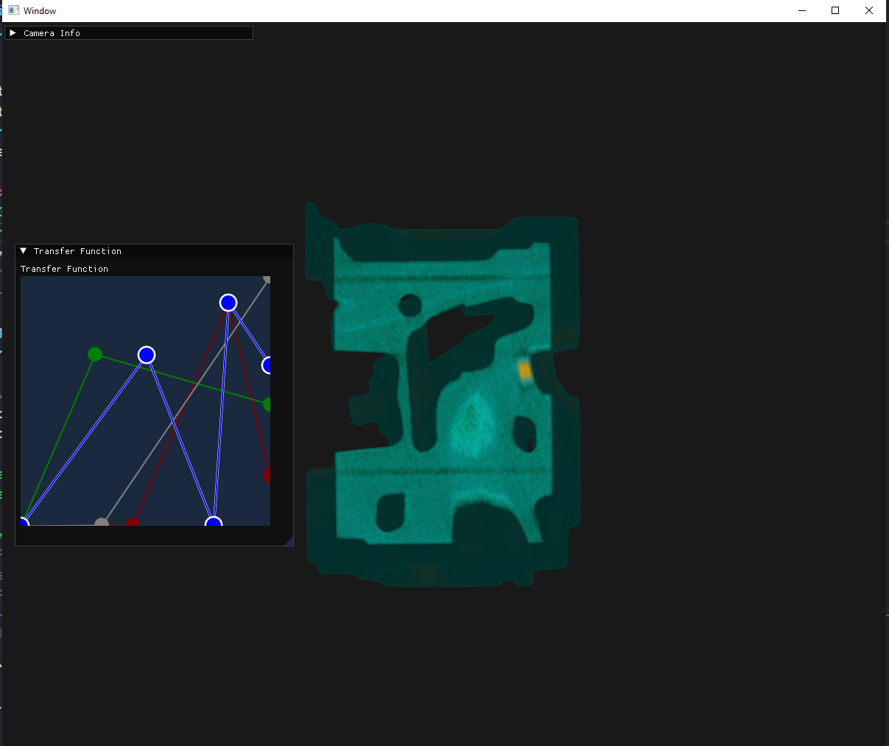
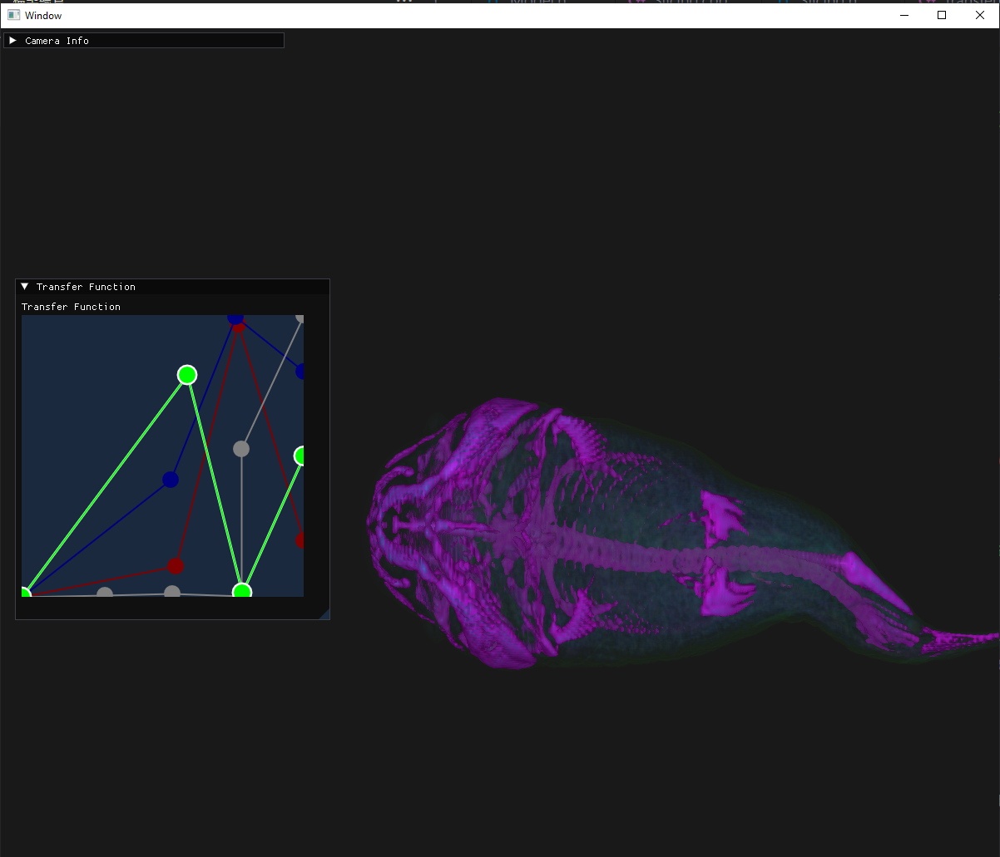
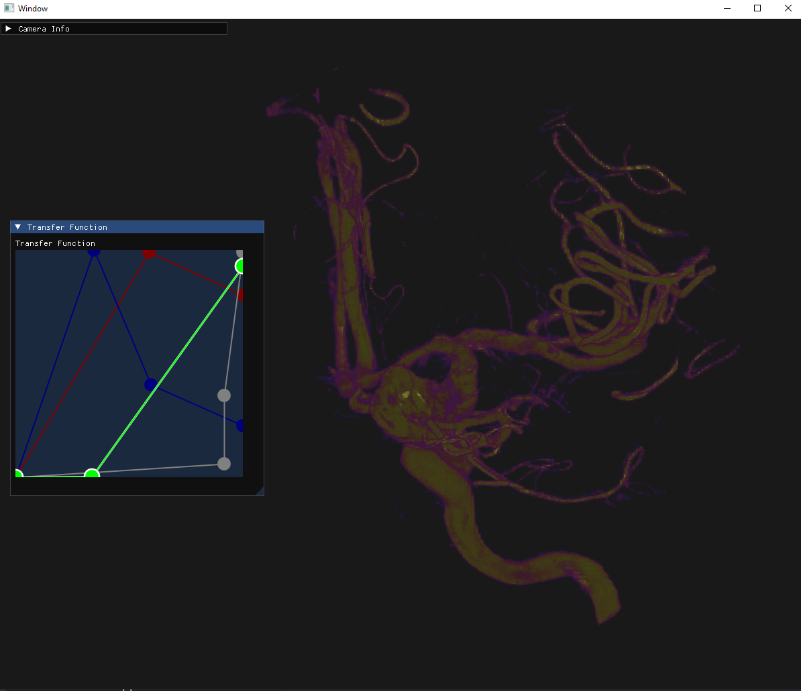

# Slice Based Volume Rendering
00957016 高敬庭

## 完成內容
+ 將volume data切片後渲染出結果
+ 利用Transfer Function調整對應硬度值結果

將volume data切為8倍，固定從z軸以back-to-front方式切。Transfer Function可使用右鍵新增或刪除節點，來調整出更好的結果
## 結果圖

